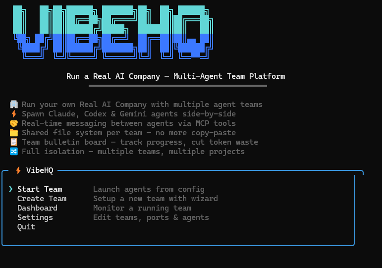
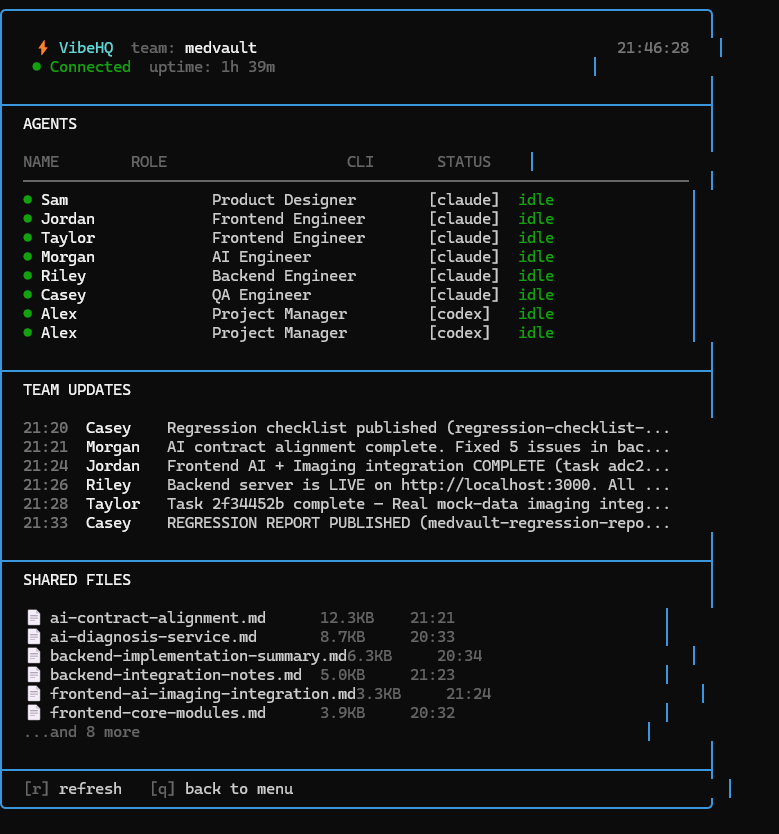

<p align="center">
  
</p>

<p align="center">
  <strong>🌐 Language:</strong>
  English |
  <a href="README.zh-TW.md">繁體中文</a> |
  <a href="README.ja.md">日本語</a>
</p>

<h1 align="center">⚡ VibeHQ</h1>

<p align="center">
  <strong>Multi-Agent AI Collaboration Platform</strong><br/>
  <em>Orchestrate Claude, Codex & Gemini agents working as a real engineering team.</em>
</p>

<p align="center">
  
  
  
  
</p>

<p align="center">
  <a href="#-the-problem">The Problem</a> •
  <a href="#-the-solution">The Solution</a> •
  <a href="#-features">Features</a> •
  <a href="#%EF%B8%8F-quickstart">Quickstart</a> •
  <a href="#-how-it-works">How It Works</a> •
  <a href="#-configuration">Configuration</a> •
  <a href="#-demo">Demo</a>
</p>

---

## 🧩 The Problem

You can talk to a single AI coding agent. But **real software isn't built by one person**.

Every serious project needs a PM to coordinate, a designer to spec the UI, a backend engineer to define the API, a frontend engineer to build the interface, and QA to verify everything works. When you try to do all of this with one agent, you get:

- 🧠 **Context collapse** — one agent can't hold PM + FE + BE + QA context simultaneously
- 🔄 **No specialization** — every prompt is a context switch
- 🚫 **No process** — no specs, no reviews, no contracts, just vibes
- 💬 **No collaboration** — agents can't talk to each other, review each other's work, or block on dependencies

**The industry is full of "multi-agent frameworks" that are really just chain-of-thought with extra steps.** They run sequentially, in the same process, with synthetic conversations. That's not collaboration — that's a pipeline.

## 💡 The Solution

VibeHQ takes a fundamentally different approach: **real CLI agents, real terminals, real collaboration.**

```
You give ONE prompt to the PM.
7 agents build an entire application.
Each agent runs in its own terminal.
They communicate through a structured protocol.
They don't start coding until specs are signed off.
```

Every agent is a **real instance** of Claude Code, Codex CLI, or Gemini CLI — running in its own terminal window, with its own working directory, its own file access scope, its own conversation context. The Hub doesn't simulate conversations. It routes messages, manages tasks, enforces contracts, and queues work until agents are ready.

**Because each agent is a real CLI process, all native CLI features work out of the box:**
- 🔧 **Claude Code**: Skills, custom MCP servers, `.claude/` project config, memory, all CLI flags
- 🔧 **Codex CLI**: Built-in tools, file editing, terminal commands, custom instructions
- 🔧 **Gemini CLI**: Extensions, Google Cloud integrations, `.gemini/` config

VibeHQ **adds** 20 collaboration tools on top — it never replaces or limits anything the CLI can already do. Your agents keep their full power; they just gain the ability to talk to each other.

**This is the difference between "multi-agent" and "multi-agent collaboration."**

<p align="center">
  
</p>

---

## 🎥 See It in Action

> 🎬 **[Watch the full 7-agent collaboration demo →](https://drive.google.com/file/d/1zzY3f8iCthb_s240rV67uiA9VpskZr2s/view?usp=sharing)**

### MCP Tools in Action

#### List Teammates — See who's online and their status

https://github.com/user-attachments/assets/5f631c4a-ba50-428a-9f8a-ac1de890a6a8

#### Teammate Talk — Real-time agent-to-agent communication

https://github.com/user-attachments/assets/e114cc9c-b468-4367-9f6f-4d855ee06abf

#### Assign Task — PM creates and assigns tasks to engineers

https://github.com/user-attachments/assets/ba2cdb27-ef29-456c-bbf7-02a157d5aaf8

---

## 🔬 Why This Architecture Matters

### Real Agent Isolation
Each agent runs as a **separate OS process** in its own PTY (pseudo-terminal). This isn't threads or coroutines — it's full process isolation. An agent's crash doesn't take down the team. An agent's context window is entirely its own. This is how real engineering teams work: separate machines, separate contexts, shared protocols.

### Contract-Driven Development
Before any code is written, specs must be published and signed. `publish_contract("api-spec.md", ["Jordan", "Sam"])` requires the frontend engineer AND designer to approve the API schema before the backend starts coding. This eliminates the #1 cause of multi-agent failure: **agents building against different assumptions.**

### Idle-Aware Message Queue
When Agent A sends a task to Agent B, and Agent B is in the middle of writing code, the message **doesn't interrupt**. It queues. When B finishes (detected via Claude Code's JSONL transcript or PTY output timeout), the queue flushes. This prevents the "new instruction mid-task" problem that destroys agent output quality.

### State Persistence
All tasks, artifacts, contracts, and team updates persist to disk (`~/.vibehq/teams/<team>/hub-state.json`). Hub restarts don't lose state. Agents can reconnect and pick up where they left off.

### MCP-Native Communication
Agents don't communicate through prompt injection hacks. They use **20 purpose-built MCP tools** that are auto-configured when each agent spawns. The tools are type-safe, the messages are structured, and the Hub validates everything.

---

## ✨ Features

### 🎯 Core Platform
- **Multi-CLI Support** — Claude Code, Codex CLI, Gemini CLI running side by side
- **Real-time Dashboard** — Live agent status, team updates, message routing visualization
- **MCP Integration** — 20 purpose-built tools injected into every agent via Model Context Protocol
- **Per-Agent Terminals** — Each agent gets its own terminal window, fully interactive
- **Hot Respawn** — Reconnect any crashed agent without restarting the team

### 🔄 V2 Collaboration Framework
- **Task Lifecycle** — `create → accept → in_progress → blocked → done` with artifact requirements
- **Contract System** — Publish API/design specs, require sign-offs before coding begins
- **Artifact Registry** — Structured document publishing with metadata and versioning
- **Idle-Aware Queue** — Messages queue when agents are busy, flush when idle
- **State Persistence** — All data survives Hub restarts via JSON file storage

### 🧠 Smart Detection
- **Claude JSONL Watcher** — Parses `~/.claude/projects/` transcript files to detect idle/working in real-time
- **PTY Output Timeout** — Fallback idle detection for Codex/Gemini (10s silence = idle)
- **Auto Preset Loading** — Role-based system prompts loaded automatically from built-in presets

### 🔒 Agent Isolation & Permissions
- **Per-agent working directories** — Each agent only sees its own code
- **`additionalDirs`** — Grant selective cross-directory access (e.g., shared mock data)
- **`dangerouslySkipPermissions`** — Optional auto-approve for Claude agents in trusted environments

---

## ⚡️ Quickstart

### Prerequisites
- **Node.js** ≥ 18
- At least one AI CLI installed:
  - [Claude Code](https://docs.anthropic.com/en/docs/claude-code) (`npm install -g @anthropic-ai/claude-code`)
  - [Codex CLI](https://github.com/openai/codex) (`npm install -g @openai/codex`)
  - [Gemini CLI](https://github.com/google-gemini/gemini-cli) (`npm install -g @anthropic-ai/gemini-cli`)

### Install (Build from Source)

> ⚠️ `npm install -g @vibehq/agent-hub` is not yet available on npm. The package will be published after registry registration is complete. For now, use the build & link method:

```bash
git clone https://github.com/0x0funky/vibehq-hub.git
cd vibehq-hub
npm install
npm run build
npm link
```

This globally registers `vibehq`, `vibehq-spawn`, and `vibehq-hub` commands.

### Launch (Windows — TUI Mode)

```bash
vibehq
```

Select a team → Start → agents spawn in new Windows Terminal tabs.

### Launch (Mac / Linux — Manual Mode)

The TUI auto-spawn currently targets Windows Terminal (`wt`), iTerm2, and standard Linux terminals. If the TUI doesn't spawn terminals correctly on your system, you can start agents manually:

```bash
# Terminal 1: Start the Hub
vibehq-hub --port 3001

# Terminal 2: Spawn agent
cd /path/to/frontend
vibehq-spawn --name "Jordan" --role "Frontend Engineer" \
  --team "my-team" --hub "ws://localhost:3001" \
  --add-dir "/path/to/shared" \
  -- claude

# Terminal 3: Spawn another agent
cd /path/to/backend
vibehq-spawn --name "Riley" --role "Backend Engineer" \
  --team "my-team" --hub "ws://localhost:3001" \
  -- claude

# Repeat for each agent...
```

### Respawn a Single Agent

If an agent crashes or disconnects, respawn it without restarting the team:

```bash
cd D:\project\qa
vibehq-spawn --name "Casey" --role "QA Engineer" \
  --team "medvault" --hub "ws://localhost:3002" \
  --skip-permissions \
  --add-dir "D:\project\frontend" \
  --add-dir "D:\project\backend" \
  -- claude
```

---

## ⚠️ Platform Support

> **VibeHQ is currently developed and tested on Windows.**
> Mac and Linux support is planned and architecturally supported, but has not been fully tested yet.

| Feature | Windows | Mac | Linux |
|---------|---------|-----|-------|
| TUI (interactive team launcher) | ✅ Tested | ⚠️ Untested (iTerm2/Terminal.app) | ⚠️ Untested (gnome-terminal/xterm) |
| Hub server | ✅ Tested | ✅ Should work | ✅ Should work |
| Manual spawn (`vibehq-spawn`) | ✅ Tested | ✅ Should work | ✅ Should work |
| Claude JSONL idle detection | ✅ Tested | ⚠️ Path encoding may differ | ⚠️ Path encoding may differ |
| PTY spawning (node-pty) | ✅ Tested | ⚠️ Untested | ⚠️ Untested |
| MCP auto-configuration | ✅ Tested | ⚠️ Config paths may differ | ⚠️ Config paths may differ |

### Potential Issues on Mac/Linux

- **Terminal spawning**: The TUI uses `wt` (Windows Terminal) on Windows, `osascript` on Mac, and `gnome-terminal`/`xterm` on Linux. If your terminal emulator isn't detected, use manual `vibehq-spawn` commands instead.
- **Claude JSONL path encoding**: Claude Code encodes project paths differently on each OS (`\` vs `/`). The watcher uses regex replacement that should handle both, but edge cases may exist.
- **node-pty compilation**: `node-pty` requires native compilation. On Mac, ensure Xcode Command Line Tools are installed (`xcode-select --install`). On Linux, ensure `build-essential` and `python3` are available.
- **MCP config paths**: Claude stores MCP config at `~/.claude/` on all platforms, but Codex (`~/.codex/`) and Gemini (`~/.gemini/`) paths may vary.
- **File path separators**: Config file paths use `\\` for Windows. On Mac/Linux, use `/` instead.

> 🍎 **Mac testing is coming soon.** Once verified, this section will be updated with confirmed support status.

---

## 🏗 How It Works

```
┌──────────────────────────────────────────────────────────┐
│                      VibeHQ Hub                           │
│                  (WebSocket Server)                      │
│                                                          │
│  ┌─────────┐  ┌──────────┐  ┌───────────┐  ┌─────────┐ │
│  │  Task    │  │ Artifact │  │ Contract  │  │ Message │ │
│  │  Store   │  │ Registry │  │  Store    │  │  Queue  │ │
│  └─────────┘  └──────────┘  └───────────┘  └─────────┘ │
│                                                          │
│  ┌─────────────────────────────────────────────────────┐ │
│  │              Agent Registry                         │ │
│  │  idle/working detection • status broadcasts         │ │
│  │  spawner subscriptions • viewer connections          │ │
│  └─────────────────────────────────────────────────────┘ │
└────────┬──────────┬──────────┬──────────┬───────────────┘
         │          │          │          │
    ┌────▼───┐ ┌────▼───┐ ┌───▼────┐ ┌───▼────┐
    │ Claude │ │ Claude │ │ Codex  │ │ Claude │
    │  (FE)  │ │  (BE)  │ │  (PM)  │ │  (QA)  │
    │ ┌────┐ │ │ ┌────┐ │ │ ┌────┐ │ │ ┌────┐ │
    │ │MCP │ │ │ │MCP │ │ │ │MCP │ │ │ │MCP │ │
    │ │20  │ │ │ │20  │ │ │ │20  │ │ │ │20  │ │
    │ │tools│ │ │ │tools│ │ │ │tools│ │ │ │tools│ │
    │ └────┘ │ │ └────┘ │ │ └────┘ │ │ └────┘ │
    └────────┘ └────────┘ └────────┘ └────────┘
     frontend    backend    root        qa
```

### Data Flow

1. **PM** calls `create_task("Build login page", ..., "Jordan")` via MCP
2. **Hub** stores the task, checks Jordan's status
3. Jordan is **working** → task enters the **message queue**
4. Jordan finishes current work → **JSONL watcher** detects `turn_duration` event → status = `idle`
5. Hub **flushes queue** → Jordan receives the task
6. Jordan calls `accept_task` → writes code → calls `complete_task` with artifact
7. Hub **persists** everything to disk, **broadcasts** status to team

---

## 📝 Configuration

### `vibehq.config.json`

```jsonc
{
  "teams": [
    {
      "name": "my-project",
      "hub": { "port": 3001 },
      "agents": [
        {
          "name": "Alex",
          "role": "Project Manager",       // Auto-loads preset system prompt
          "cli": "codex",
          "cwd": "D:\\my-project"          // Use "/" on Mac/Linux
        },
        {
          "name": "Jordan",
          "role": "Frontend Engineer",
          "cli": "claude",
          "cwd": "D:\\my-project\\frontend",
          "dangerouslySkipPermissions": true,
          "additionalDirs": ["D:\\my-project\\shared"]
        }
      ]
    }
  ]
}
```

### Agent Config Reference

| Field | Type | Default | Description |
|-------|------|---------|-------------|
| `name` | `string` | *required* | Agent display name (unique per team) |
| `role` | `string` | *required* | Role — auto-loads matching preset if no `systemPrompt` |
| `cli` | `string` | *required* | `claude`, `codex`, or `gemini` |
| `cwd` | `string` | *required* | Working directory (isolated per agent) |
| `systemPrompt` | `string?` | preset | Custom system prompt (overrides role preset) |
| `dangerouslySkipPermissions` | `bool?` | `false` | Skip Claude permission prompts (Claude only) |
| `additionalDirs` | `string[]?` | `[]` | Extra directories the agent can access (Claude `--add-dir`) |

### Built-in Role Presets

When `systemPrompt` is omitted, VibeHQ auto-loads a V2-aware prompt based on the `role` field:

| Role | Focus |
|------|-------|
| Project Manager | Task delegation, spec-first workflow, progress tracking |
| Product Designer | Design specs, contract review, visual QA |
| Frontend Engineer | UI development, contract-first API integration |
| Backend Engineer | API-first development, contract publishing |
| AI Engineer | ML pipeline, model integration |
| QA Engineer | Test planning, cross-module verification |

All presets include the full list of 20 MCP tools and enforce the contract-first workflow.

---

## 🚀 V2 Collaboration Framework — 20 MCP Tools

<details>
<summary><strong>💬 Communication (6 tools)</strong></summary>

| Tool | Description |
|------|-------------|
| `ask_teammate(name, question)` | Ask a teammate a question (async, queued if busy) |
| `reply_to_team(name, message)` | Send a reply/message to a specific teammate |
| `post_update(message)` | Broadcast a status update to the entire team |
| `get_team_updates(limit?)` | Read recent team-wide updates |
| `list_teammates()` | See all teammates with their name, role, and current status |
| `check_status(name?)` | Check if a specific teammate is idle/working |

</details>

<details>
<summary><strong>📋 Task Management (5 tools)</strong></summary>

| Tool | Description |
|------|-------------|
| `create_task(title, desc, assignee, priority)` | Create a tracked task (returns taskId) |
| `accept_task(task_id, accepted, note?)` | Accept or reject an assigned task |
| `update_task(task_id, status, note?)` | Update task to `in_progress` or `blocked` |
| `complete_task(task_id, artifact, note?)` | Mark done — **must include artifact** reference |
| `list_tasks(filter?)` | List tasks: `all`, `mine`, or `active` |

</details>

<details>
<summary><strong>📦 Artifacts & Shared Files (5 tools)</strong></summary>

| Tool | Description |
|------|-------------|
| `publish_artifact(filename, content, type, summary)` | Publish structured document with metadata |
| `list_artifacts(type?)` | List published artifacts by type |
| `share_file(filename, content)` | Save file to team's shared folder |
| `read_shared_file(filename)` | Read from shared folder |
| `list_shared_files()` | List all shared files |

</details>

<details>
<summary><strong>📜 Contract Sign-Off (3 tools)</strong></summary>

| Tool | Description |
|------|-------------|
| `publish_contract(spec_path, required_signers[])` | Publish spec requiring sign-offs |
| `sign_contract(spec_path, comment?)` | Approve a contract |
| `check_contract(spec_path?)` | Check sign-off status |

</details>

<details>
<summary><strong>🧰 System (1 tool)</strong></summary>

| Tool | Description |
|------|-------------|
| `get_hub_info()` | Get Hub connection status and agent info |

</details>

---

## 🎬 Demo

### What We Built: MedVault — AI Hospital System

7 AI agents collaborating to build a full-stack hospital management platform from a single PM prompt:

| Agent | Role | CLI | What They Built |
|-------|------|-----|-----------------|
| Alex | Project Manager | Codex | Coordination, task tracking, spec reviews |
| Sam | Product Designer | Claude | UI/UX design specs, color system, component layouts |
| Jordan | Frontend Lead | Claude | Dashboard, Patient Records, Login pages |
| Taylor | Imaging Specialist | Claude | Medical imaging viewer (zoom, pan, brightness) |
| Riley | Backend Engineer | Claude | REST API, SQLite DB, JWT auth |
| Morgan | AI Engineer | Claude | AI diagnosis endpoint with confidence scoring |
| Casey | QA Engineer | Claude | Integration testing, bug reports |

### Demo Highlights

- **Real-time agent conversation** — agents asking each other questions and replying through MCP tools
- **Task creation & acceptance** — PM creates tasks, engineers accept/reject with notes
- **Contract negotiation** — Backend publishes API spec → Frontend and Designer review and sign
- **Contract approval broadcast** — `"✅ CONTRACT APPROVED"` sent to entire team simultaneously
- **Status transitions** — Dashboard showing agents moving between `idle` ↔ `working` in real-time
- **Queue in action** — Messages waiting while an agent is busy, then flushing when idle
- **Bug reporting flow** — QA finds issue → reports to engineer → engineer fixes → re-tests
- **Artifact publishing** — Design specs, API docs, test reports shared across the team
- **Final product** — Login → Dashboard → Patient records → X-Ray viewer → AI diagnosis

### Workflow in Action

```
PM creates task ──► Engineer accepts ──► Writes spec
                                              │
                                    publish_contract
                                              │
                              Team signs off ◄─┘
                                    │
                              Code begins
                                    │
                          complete_task + artifact
                                    │
                              QA verification
```

---

## 🛠 CLI Reference

### Commands

```bash
vibehq              # Interactive TUI (Windows recommended)
vibehq start        # Start a team directly from config
vibehq init         # Create a new vibehq.config.json
vibehq dashboard    # Dashboard only (connect to existing hub)
```

### Standalone Hub

```bash
vibehq-hub --port 3001 --verbose
```

### Spawn Single Agent

```bash
vibehq-spawn \
  --name "Jordan" \
  --role "Frontend Engineer" \
  --team "my-team" \
  --hub "ws://localhost:3001" \
  --skip-permissions \
  --add-dir "/path/to/shared" \
  --system-prompt-file "./custom-prompt.md" \
  -- claude
```

---

## 📁 Project Structure

```
agent-hub/
├── bin/
│   ├── start.ts          # Main CLI entry (TUI, team management)
│   ├── spawn.ts          # Single agent spawner CLI
│   ├── hub.ts            # Standalone hub server
│   └── agent.ts          # MCP agent server
├── src/
│   ├── hub/
│   │   ├── server.ts     # WebSocket hub + V2 stores + persistence
│   │   ├── registry.ts   # Agent registry + idle routing + spawner tracking
│   │   └── relay.ts      # Message relay engine
│   ├── spawner/
│   │   └── spawner.ts    # PTY manager + JSONL watcher + idle detection
│   ├── mcp/
│   │   ├── hub-client.ts # MCP ↔ Hub WebSocket bridge
│   │   └── tools/        # 20 MCP tool implementations
│   ├── shared/
│   │   └── types.ts      # Shared TypeScript types (V2 messages)
│   └── tui/
│       ├── role-presets.ts    # Built-in role system prompts (V2)
│       └── screens/           # Dashboard, welcome, settings, create-team
├── vibehq.config.json    # Team configuration
└── images/               # Screenshots
```

---

## 🤝 Contributing

PRs welcome. The architecture is modular:
- **New MCP tool?** Add to `src/mcp/tools/` + register in `hub-client.ts`
- **New CLI support?** Add detection in `spawner.ts` + MCP config in `autoConfigureMcp()`
- **New dashboard widget?** Extend `src/tui/screens/dashboard.ts`

## 📄 License

MIT

---

<p align="center">
  <a href="https://x.com/0x0funky">𝕏 @0x0funky</a>
</p>
